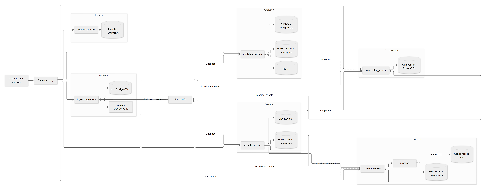
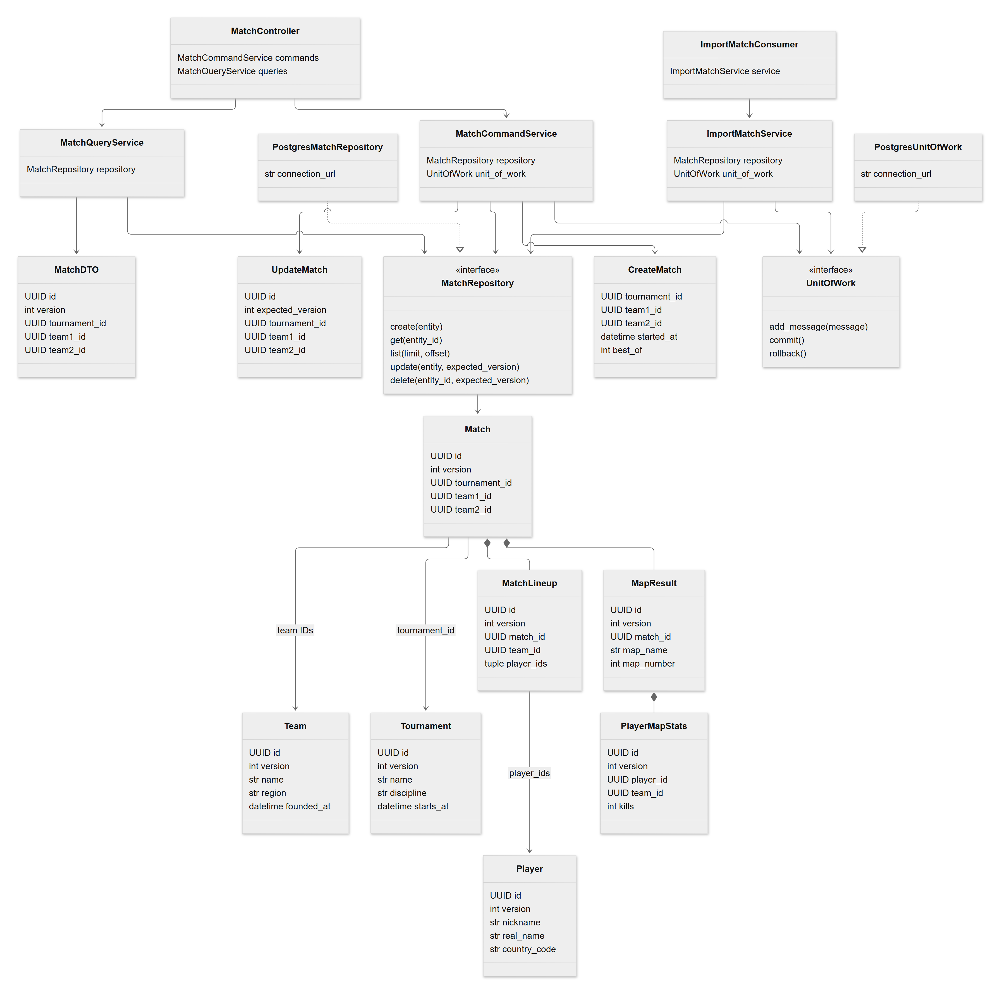
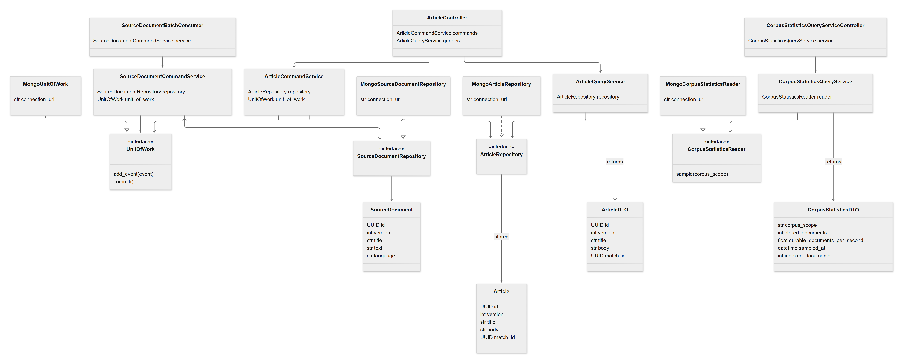
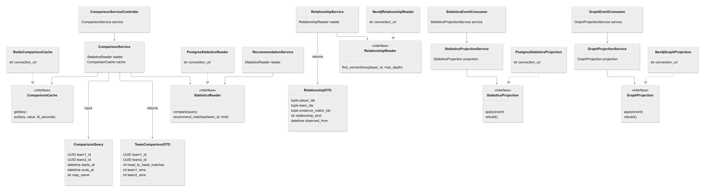
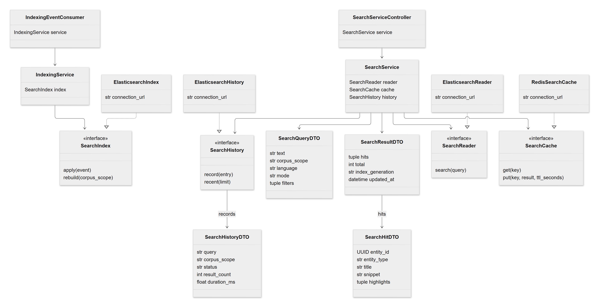
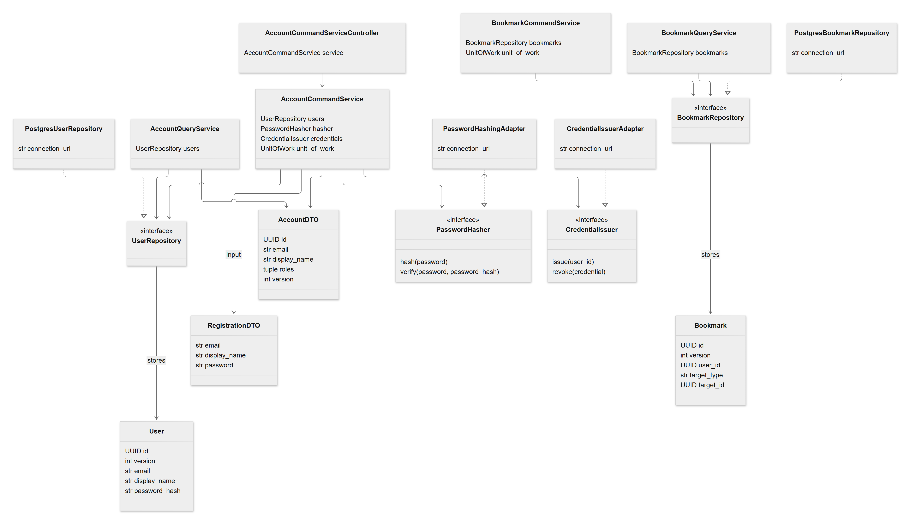
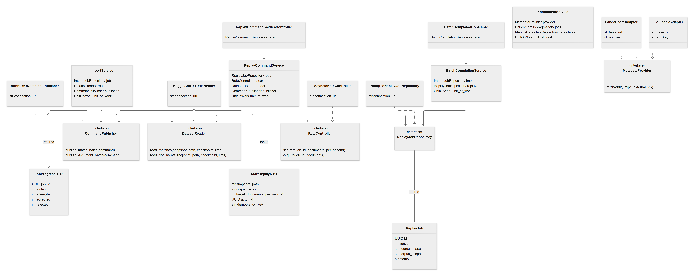
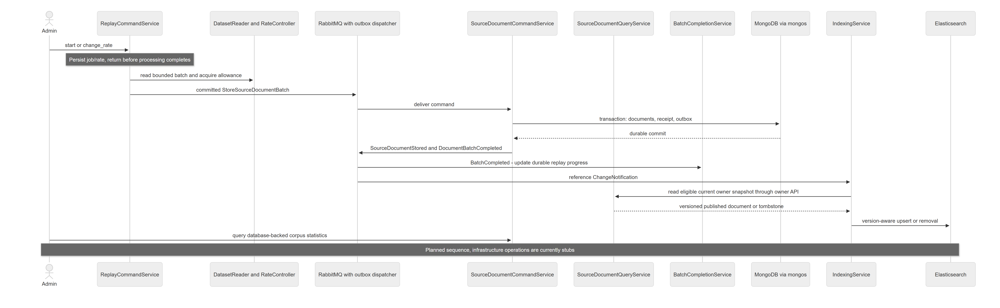

# Diagram Images

All eight diagrams are available as high-resolution PNGs. These exports were rendered from the Mermaid sources and visually inspected.

## Modules

[PNG](../diagrams/images/modules.png)

## Competition Classes

[PNG](../diagrams/images/competition-classes.png)

## Content Classes

[PNG](../diagrams/images/content-classes.png)

## Analytics Classes

[PNG](../diagrams/images/analytics-classes.png)

## Search Classes

[PNG](../diagrams/images/search-classes.png)

## Identity Classes

[PNG](../diagrams/images/identity-classes.png)

## Ingestion Classes

[PNG](../diagrams/images/ingestion-classes.png)

## Document Flow

[PNG](../diagrams/images/document-flow.png)

