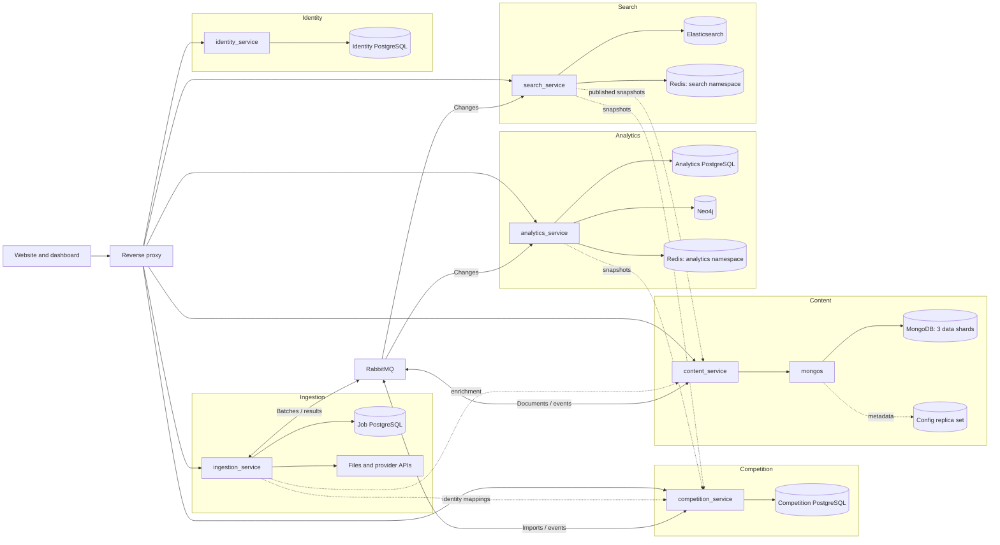
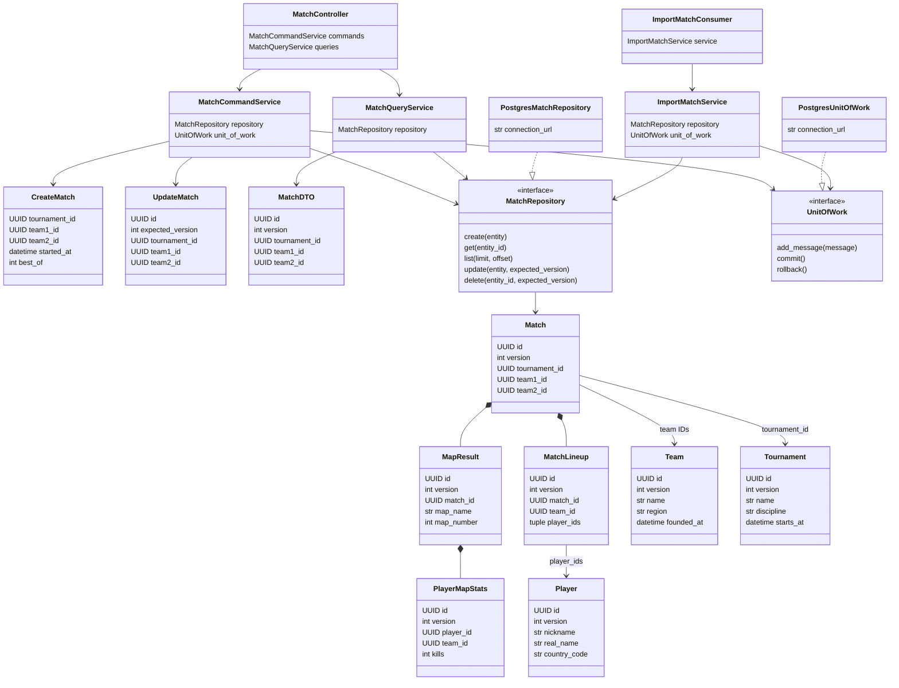
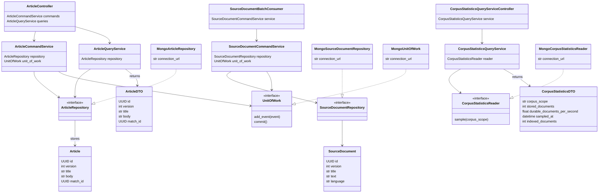
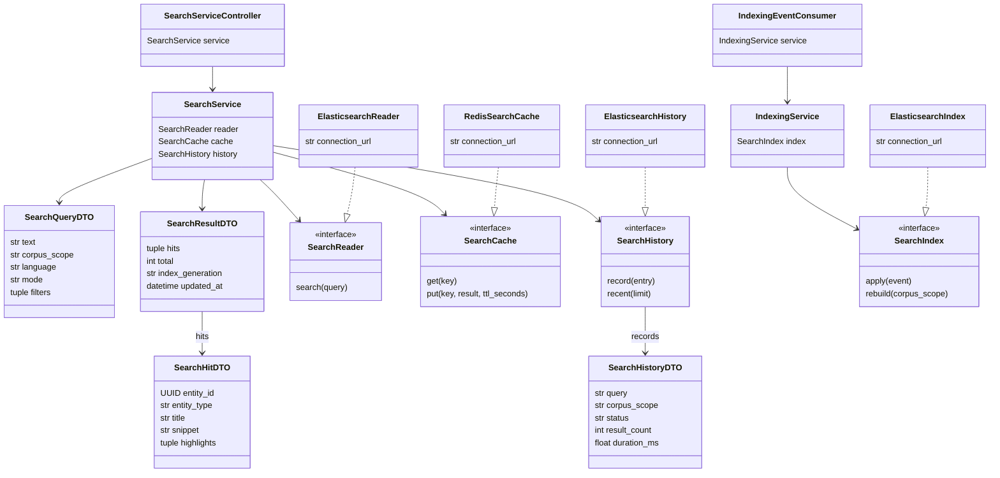
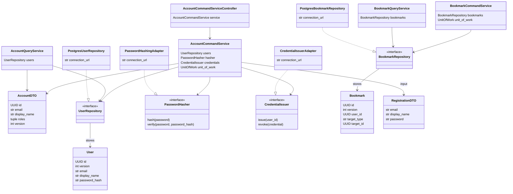
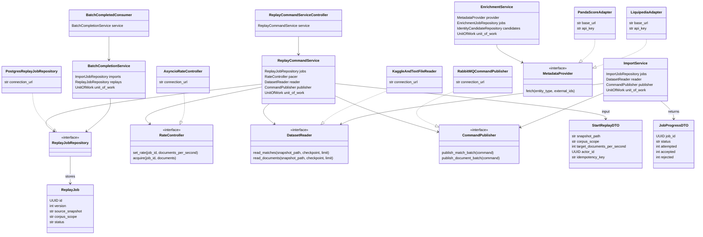
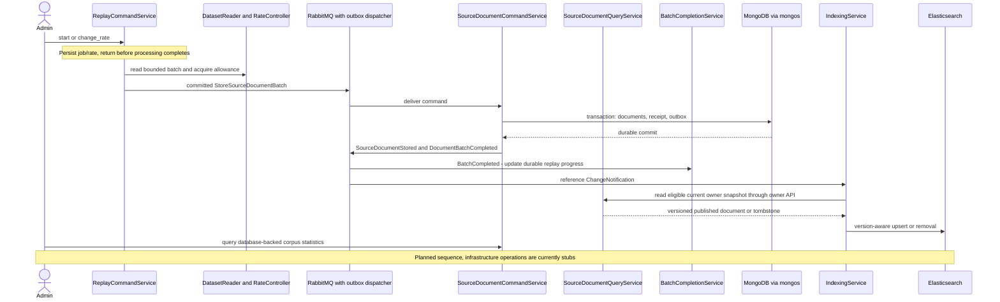

# Module and Class Diagrams

The class diagrams reference classes in the current skeleton. Interface realization arrows represent nominal or structural Python protocol implementation. Method execution, HTTP route registration, database topology, and broker operation are planned, not deployed.

Each diagram is also stored as an editable `.mmd` source. The diagrams select representative interactions rather than placing every DTO on one unreadable page; [Code inventory](code-inventory.md) lists the complete class set.

## Modules

[Editable Mermaid source](../diagrams/modules.mmd)

The module overview flows from left to right. Each group keeps a service near its storage. Solid arrows show routing, storage access, and labeled broker traffic; dashed arrows show direct owner-API reads or enrichment submissions. The two Redis symbols are namespaces that may share one deployment. MongoDB represents three data shards plus separate configuration infrastructure.

Files include Kaggle and prepared corpora; provider APIs include PandaScore and optional Liquipedia. Elasticsearch includes corpus and telemetry indexes. All infrastructure remains planned. Class diagrams below show selected fields from the actual Python declarations; optional markers and some collection details are abbreviated for readability. The code inventory contains the full definitions.

## Competition Classes

[Editable Mermaid source](../diagrams/competition-classes.mmd)

## Content Classes

[Editable Mermaid source](../diagrams/content-classes.mmd)

## Analytics Classes

[Editable Mermaid source](../diagrams/analytics-classes.mmd)

```mermaid
classDiagram
    class ComparisonServiceController {
        ComparisonService service
    }
    class ComparisonService {
        StatisticsReader reader
        ComparisonCache cache
    }
    class StatisticsReader {
        <<interface>>
        compare(query)
        recommend_matches(team_id, limit)
    }
    class PostgresStatisticsReader {
        str connection_url
    }
    class ComparisonCache {
        <<interface>>
        get(key)
        put(key, value, ttl_seconds)
    }
    class RedisComparisonCache {
        str connection_url
    }
    class RelationshipService {
        RelationshipReader reader
    }
    class RelationshipReader {
        <<interface>>
        find_connections(player_id, max_depth)
    }
    class Neo4jRelationshipReader {
        str connection_url
    }
    class RecommendationService {
        StatisticsReader reader
    }
    class StatisticsEventConsumer {
        StatisticsProjectionService service
    }
    class StatisticsProjectionService {
        StatisticsProjection projection
    }
    class StatisticsProjection {
        <<interface>>
        apply(event)
        rebuild()
    }
    class PostgresStatisticsProjection {
        str connection_url
    }
    class GraphEventConsumer {
        GraphProjectionService service
    }
    class GraphProjectionService {
        GraphProjection projection
    }
    class GraphProjection {
        <<interface>>
        apply(event)
        rebuild()
    }
    class Neo4jGraphProjection {
        str connection_url
    }
    ComparisonServiceController --> ComparisonService
    ComparisonService --> StatisticsReader
    ComparisonService --> ComparisonCache
    PostgresStatisticsReader ..|> StatisticsReader
    RedisComparisonCache ..|> ComparisonCache
    RelationshipService --> RelationshipReader
    Neo4jRelationshipReader ..|> RelationshipReader
    RecommendationService --> StatisticsReader
    StatisticsEventConsumer --> StatisticsProjectionService
    StatisticsProjectionService --> StatisticsProjection
    PostgresStatisticsProjection ..|> StatisticsProjection
    GraphEventConsumer --> GraphProjectionService
    GraphProjectionService --> GraphProjection
    Neo4jGraphProjection ..|> GraphProjection
    class ComparisonQuery {
        UUID team1_id
        UUID team2_id
        datetime starts_at
        datetime ends_at
        str map_name
    }
    ComparisonService --> ComparisonQuery : input
    class TeamComparisonDTO {
        UUID team1_id
        UUID team2_id
        int head_to_head_matches
        int team1_wins
        int team2_wins
    }
    ComparisonService --> TeamComparisonDTO : returns
    class RelationshipDTO {
        tuple player_ids
        tuple team_ids
        tuple evidence_match_ids
        str relationship_kind
        datetime observed_from
    }
    RelationshipService --> RelationshipDTO : returns
```

## Search Classes

[Editable Mermaid source](../diagrams/search-classes.mmd)

## Identity Classes

[Editable Mermaid source](../diagrams/identity-classes.mmd)

## Ingestion Classes

[Editable Mermaid source](../diagrams/ingestion-classes.mmd)

## Document Flow

[Editable Mermaid source](../diagrams/document-flow.mmd)

